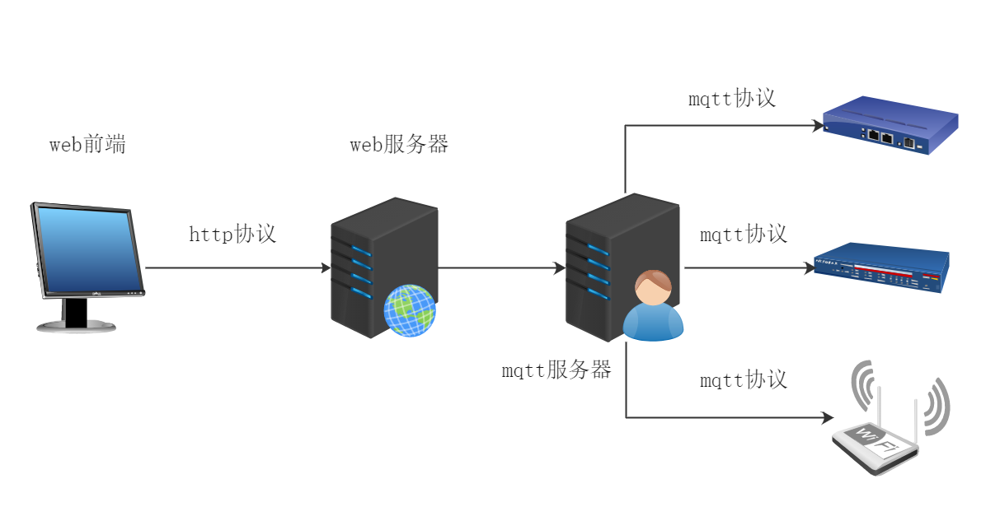
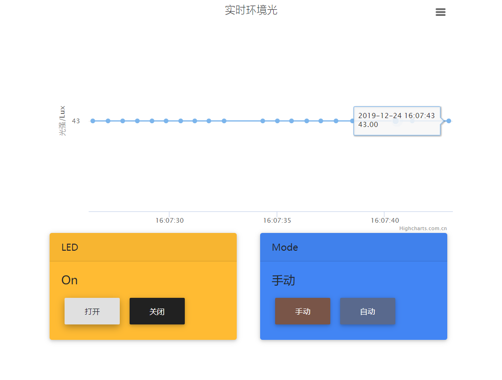
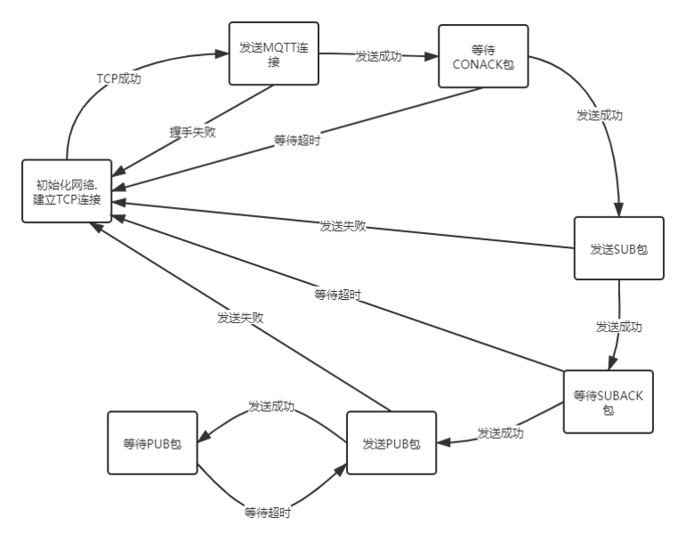
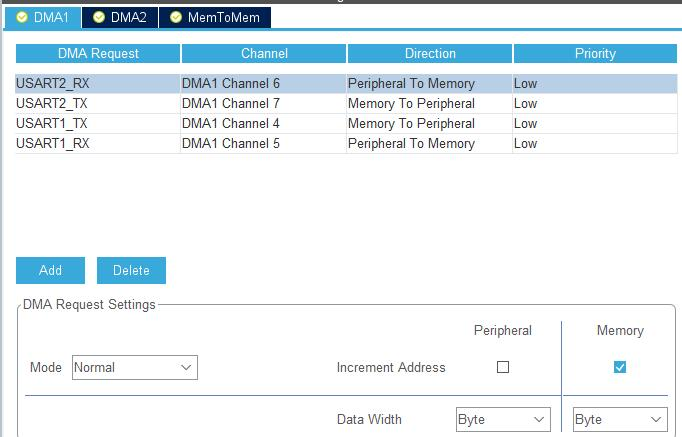
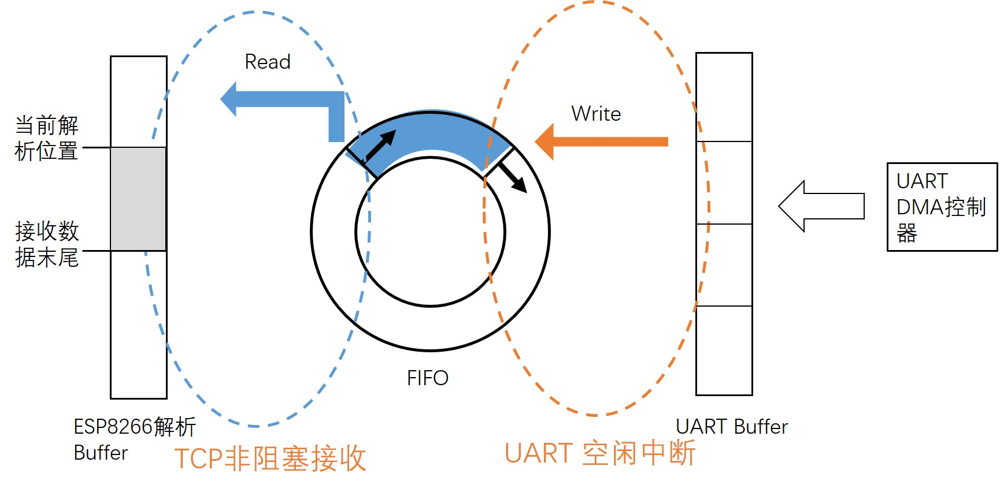
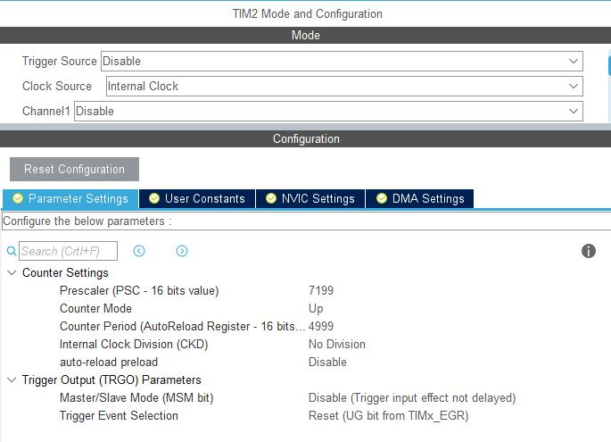

# 基于HAL(CubeMX)库和MQTT协议的STM32模拟智能街灯
## 项目要求
- 收集并上传环境光传感器的测量数据到服务器
- 收集并上传开发板(开/关)上的LED状态到服务器
- 实现一个web页面/移动应用程序/微信迷你程序，要求如下:

1. 可视化环境光传感器的测量
2. 控制LED有两种模式: 在远程应用程序上切换这两种模式

- 手动模式:在远程应用上手动控制LED的开关
- 自动模式:根据环境测量值控制LED的开关光传感器。当测量值低于50勒克斯时打开LED，当测量值低于50勒克斯时关闭LED

## 架构


1. MQTT Broker使用emqx
2. 前端使用mqtt.js通过Websocket连接Broker
3. 设备通过MQTT协议连接Broker

###
前端界面使用highchart画图,并使用了mdbootsrap来制作按钮卡片


## 设备端

### 设备总览
  
### 业务逻辑
MQTT各主题:

- light：硬件往这个topic发布环境中的灯光信息，直接传int值
- ledh：硬件往这个topic发布led灯的暗灭信息，0为关灯，1为开灯
- ledmode: 硬件往这个topic发布led灯的暗灭信息，1为手动模式，2为自动模式。
- mode：服务器往这个topic发布指令，1为手动模式，2为自动模式。
- leds：服务器往这个topic发布指令，如果硬件为手动模式，0为关灯，1为开灯。

  
esp8266驱动来自于[atakansarioglu/esp8266-iot-driver](https://github.com/atakansarioglu/esp8266-iot-driver),但无法直接应用于HAL开发,需要做如下移植适配.
### 1. ESP8266的串口封装
借助cubeMX的HAL库的便利性, 这里直接在cubeMX上将uart2串口DMA控制器打开. 并同时在代码中手动配置UART2的空闲中断.
1. 当串口有消息进来时,DMA控制器会直接将消息往指定内存地址中写入.
2. 当一次串口消息接收完成时,会触发空闲中断,通知CPU处理Buffer.
3. CPU从BUFFER中取数据,放入ESP8266驱动层的FIFO中,等待下一次空闲中断

 
 

`main.c`中开启空闲中断, 开启DMA控制器, 并初始化FIFO:
```c
...
fifo_alloc(&rxFifo, FIFO_BUFFER_SIZE);
HAL_UART_Receive_DMA(&huart2, rxBuffer, RX_BUFFER_SIZE);
__HAL_UART_ENABLE_IT(&huart2, UART_IT_IDLE);
...
```

`stm32f1xx_it.c`中对于USART2的空闲中断的处理:
```c
...
void USART2_IRQHandler(void)
{
  /* USER CODE BEGIN USART2_IRQn 0 */
  	uint32_t tmp_flag = 0;
    uint32_t temp;
    tmp_flag =  __HAL_UART_GET_FLAG(&huart2,UART_FLAG_IDLE);
    if((tmp_flag != RESET))
      {
      __HAL_UART_CLEAR_IDLEFLAG(&huart2);
      temp = huart2.Instance->SR;	// read as clear
      temp = huart2.Instance->DR;
      HAL_UART_DMAStop(&huart2);
      temp  = hdma_usart2_rx.Instance->CNDTR;
      rx_len =  RX_BUFFER_SIZE - temp;
      recv_end_flag = 1;
      HAL_UART_IdleCpltCallback(&huart2);
    }

  /* USER CODE END USART2_IRQn 0 */
  HAL_UART_IRQHandler(&huart2);
  /* USER CODE BEGIN USART2_IRQn 1 */

  /* USER CODE END USART2_IRQn 1 */
}
...
```
上面的对Idle Interrupt的处理中,仿照了HAL库原有的中断处理方式,在重新设置各寄存器和标志位后调用
`HAL_UART_IdleCpltCallback(&huart2)`这个回调函数,该函数在`ESP8266Client\src\ESP8266Client.c`中实现:
```c
...
void HAL_UART_IdleCpltCallback(UART_HandleTypeDef *huart){
	if(huart == &huart2 && recv_end_flag == 1){
		fifo_in(&rxFifo, rxBuffer, rx_len);
		memset(rxBuffer+rx_len,0,RX_BUFFER_SIZE-rx_len);
		HAL_UART_Receive_DMA(&huart2, rxBuffer, RX_BUFFER_SIZE);
	}
}
...
```
然后每次
1. 向ESP8266发送命令后后的检查response
2. 非阻塞接收检查是否受到数据
时,都需要从FIFO中取出数据.
`Src\ESP8266Client\src\ESP8266Client.c`:
```c
...
ESP82_Result_t ESP82_Receive(char * const data, const uint8_t dataLengthMax) {
    ...
    int popLength = fifo_out(&rxFifo, &ESP82_resBuffer[ESP82_resBufferBack], ESP82_BUFFERSIZE_RESPONSE - 1 - ESP82_resBufferBack);
	ESP82_resBufferBack += popLength;
	uint8_t availableLength = (ESP82_resBufferBack - ESP82_resBufferFront);
	recv_end_flag == 0;
    ...
}

...

static ESP82_Result_t ESP82_checkResponse(const uint32_t expectedFlags, const uint16_t timeout_ms, char * const responseOut, const uint8_t responseLengthMax){
    ...
    // Get response data and terminate as a string.
	ESP82_resBufferBack += fifo_out(&rxFifo, &ESP82_resBuffer[ESP82_resBufferBack], ESP82_BUFFERSIZE_RESPONSE - 1 - ESP82_resBufferBack);
	ESP82_resBuffer[ESP82_resBufferBack] = 0;
	recv_end_flag == 0;
    ...
}
...

```
### 2.收到空数据时返回空标志(-2)以区分`IN_PROGRESS`状态
原本的代码中使用`IN_PROGRESS`(0)来表示ESP8266驱动层正在解析命令.  
且原代码使用有限状态机,必须上层任务必须多次循环才能驱动一次底层解析完成.  
但是,如果没有收到数据,底层驱动也会返回0表示其没有收到.  

也就是说,上层函数无法区分底层到底是正在解析还是没收到数据.  
于是修改原有代码, 定义`ESP82_RECEIVE_NOTHING`(-2)状态码来特别区分没有收到数据的情况.  

首先还是在`ESP8266Client.c`中修改`ESP82_Receive()`函数,使其增加一个状态:
```c
...
ESP82_Result_t ESP82_Receive(char * const data, const uint8_t dataLengthMax) {
    ...
	case ESP82_State1:
		// Get the incoming data header.
		if(availableLength >= 7){
        ...
		}
		else if(availableLength == 0){
			ESP82_inProgress = false;
			return ESP82_RECEIVE_NOTHING;
			// recv nothing;
		}
        ...
}
...
```

然后在高一层的`networkwrapper.c`的`network_recv()`函数中, 检测`ESP82_RECEIVE_NOTHING`状态:
```c
...
int network_recv(unsigned char *address, unsigned int maxbytes){
    ...
    // Recv nothing.
    if(espResult == ESP82_RECEIVE_NOTHING){
        // Reset the state machine.
        network_recv_state = 0;
        return -2;
    }

    // In progress.
    return 0;
}
...
```

在更高一层的`transport.c`中,也要修改其非阻塞接收函数`transport_getdatanb()`,原本只调用底层函数一次,将推动状态机的任务交给了上层函数. 
这里直接改为循环调用底层函数, 在该层完成状态机的推动. 修改后再返回0是没有歧义的,就是表示没有收到数据:
```c
...
int transport_getdatanb(void *sck, unsigned char* buf, int count)
{
//int sock = *((int *)sck); 		/* sck: pointer to whatever the system may use to identify the transport */
transport_iofunctions_t *myio = io;	// io[sock] or mystruct[sock].io
int len;
	
	/* you should have called open() with a valid pointer to a valid struct before calling this */
	assert((myio != NULL) && (myio->recv != NULL));
	/* this call will return immediately if no bytes, or return whatever outstanding bytes we have,
	 upto count */
	while((len = myio->recv(buf, count)) == 0);
	if (len >0 )
		return len;
	if (len==-2)
		return 0;
	if(len == -1)
		return TRANSPORT_ERROR;
}
...
```
### 3.使用定时器中断来更新硬件信息
 

这里用了TIM2作为时钟源. 在定时器周期到达回调函数中,更新硬件信息, 并且用闪灯表示连接上了MQTT Broker:  
`main.c`:
```c
...
void HAL_TIM_PeriodElapsedCallback(TIM_HandleTypeDef *htim)
{
	if (htim->Instance == TIM2)
  {
    updateDeviceInfo();
    if(MQTT_connected){
    	HAL_GPIO_TogglePin(LED1_GPIO_Port, LED1_Pin);
    }
    else{
    	HAL_GPIO_WritePin(LED1_GPIO_Port, LED1_Pin, SET);
    }
  }
}
...
void updateDeviceInfo()
{
  ledStatus = HAL_GPIO_ReadPin(LED0_GPIO_Port, LED0_Pin);
  ledStatus = !ledStatus;
  lightSensorValue = lightSensorLux();
  if (ledMode == 2)// Auto mode
  {
    HAL_GPIO_WritePin(LED0_GPIO_Port, LED0_Pin, lightSensorValue >= 50);
  }
  else if(ledMode == 1){// Manual mode
	  HAL_GPIO_WritePin(LED0_GPIO_Port, LED0_Pin, !ledSwitch);
  }
}
...
```

### 4.What To Do Next
1. 目前运行的版本是直接基于HAL库, 不带os, 日后可以将其移植到freeRTOS上, 不同的任务用不同的os task进行, 可以提高程序可读性. 

### 5.参考
1. 参考的项目地址:[atakansarioglu/mqtt_temperature_logger_esp8266](https://github.com/atakansarioglu/mqtt_temperature_logger_esp8266),主要使用了它的,ESP8266驱动
2. FIFO的实现来自于: [linux内核的队列实现移植](https://blog.csdn.net/u013401853/article/details/53063434)
3. MQTT驱动来自Paho MQTT, 用于解析MQTT数据包和将数据序列化到MQTT包中.


